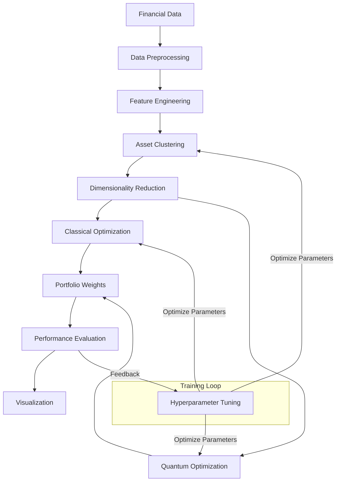

# High-Dimensional-Portfolio-Optimization-A-Quantum-Approach

A machine learning framework for portfolio optimization using quantum computing techniques.

## Overview

This package implements a portfolio optimization system that leverages quantum computing and machine learning to optimize investment portfolios. By combining hierarchical clustering for dimensionality reduction with quantum optimization algorithms, this approach efficiently handles high-dimensional portfolios with many assets.

Key features:

- **Quantum-enhanced optimization**: Utilizes quantum computing techniques to potentially find better solutions than classical methods
- **Hierarchical clustering**: Reduces dimensionality by grouping similar assets
- **Cross-validation and hyperparameter tuning**: Finds optimal parameters through time series cross-validation
- **Multiple risk measures**: Supports variance, Conditional Value at Risk (CVaR), and drawdown-based optimization
- **Comprehensive evaluation**: Provides detailed performance metrics and visualizations

## Installation

### Prerequisites

- Python 3.8 or higher
- Qiskit and other dependencies (installed automatically)

### Install from source

```bash
git clone https://github.com/quantum-portfolio/quantum-portfolio-optimizer.git
cd quantum-portfolio-optimizer
pip install -e .
```

## Quick Start

```python
from quantum_portfolio.data.dataset import FinancialDataset
from quantum_portfolio.models.clustering import AssetClustering
from quantum_portfolio.models.quantum_model import QuantumPortfolioModel
import yaml

# Load configuration
with open('config/default.yaml', 'r') as file:
    config = yaml.safe_load(file)

# Initialize components
dataset = FinancialDataset(config_path='config/default.yaml')
clustering = AssetClustering(config)
quantum_model = QuantumPortfolioModel(config)

# Fetch data
prices = dataset.fetch_data()
returns = dataset.calculate_returns()

# Perform clustering
n_clusters = 5
clusters = clustering.cluster_assets(returns, n_clusters=n_clusters)

# Calculate cluster returns and statistics
cluster_returns = clustering.calculate_cluster_returns(returns)
cluster_means = cluster_returns.mean()
cluster_cov = cluster_returns.cov()

# Run quantum optimization
quantum_result = quantum_model.optimize(cluster_means, cluster_cov, clusters)

# Get benchmark returns
benchmark_returns = dataset.get_benchmark_returns()

# Evaluate portfolio
metrics = quantum_model.evaluate_portfolio(returns, benchmark_returns)

# Print results
print("Portfolio Weights:")
for asset, weight in sorted(quantum_model.portfolio_weights.items()):
    print(f"  {asset}: {weight:.4f}")

print("\nPerformance Metrics:")
for metric, value in metrics.items():
    print(f"  {metric}: {value:.4f}")
```

## Command Line Usage

The package provides a command-line interface for running optimizations:

```bash
# Run optimization with default parameters
quantum-portfolio --mode optimize

# Train a model to find optimal hyperparameters
quantum-portfolio --mode train --plot

# Evaluate a portfolio with specific parameters
quantum-portfolio --mode evaluate --load_params params.yaml --plot

# Compare quantum and classical optimization
quantum-portfolio --mode optimize --compare --plot
```

## Configuration

The system is configured through a YAML file. The default configuration is in `config/default.yaml`. You can provide a custom configuration file with the `--config` parameter:

```bash
quantum-portfolio --config my_config.yaml
```

Configuration parameters include:

- Data settings (tickers, dates, frequency)
- Clustering parameters (method, number of clusters)
- Quantum model settings (backend, ansatz type)
- Optimization parameters (risk measures, constraints)
- Training settings (cross-validation, hyperparameter optimization)
- Visualization settings

## Key Components

1. **Data Module**: Handles financial data acquisition, preprocessing, and feature engineering.
2. **Clustering Module**: Implements dimensionality reduction through asset clustering.
3. **Quantum Model**: Portfolio optimization using quantum algorithms.
4. **Classical Model**: Traditional portfolio optimization methods for comparison.
5. **Training Module**: Hyperparameter optimization and time series cross-validation.
6. **Evaluation Module**: Performance metrics calculation and visualization.

## System Architecture



The diagram shows the complete workflow from data ingestion to final visualization, including the training loop for hyperparameter optimization.

## Advanced Features

### Time Series Cross-Validation

The system implements proper time series cross-validation to avoid look-ahead bias:

```python
from quantum_portfolio.data.dataset import FinancialDataset

dataset = FinancialDataset()
prices = dataset.fetch_data()
returns = dataset.calculate_returns()

# Create time series splits
splits = dataset.create_time_series_splits(
    data=returns,
    method='expanding_window',  # or 'sliding_window'
    n_splits=5,
    test_size=60  # 60 days for test period
)

# Use splits for training and testing
for i, (train, test) in enumerate(splits):
    print(f"Split {i+1}: train={train.shape}, test={test.shape}")
```

### Hyperparameter Tuning

Find optimal parameters through Bayesian optimization:

```python
from quantum_portfolio.training.trainer import PortfolioTrainer

trainer = PortfolioTrainer(config, dataset, clustering, quantum_model)
results = trainer.train()

# Get best parameters
print("Best parameters:", trainer.best_params)

# Train final model with best parameters
final_results = trainer.final_model()
```

### Visualization

Generate comprehensive visualizations:

```python
from quantum_portfolio.evaluation.visualization import PortfolioVisualizer

visualizer = PortfolioVisualizer(config)

# Plot portfolio weights
fig_weights = visualizer.plot_portfolio_weights(final_results['portfolio_weights'])

# Plot performance metrics
fig_metrics = visualizer.plot_performance_metrics(final_results['metrics'])

# Plot performance over time
portfolio_returns = returns.dot([final_results['portfolio_weights'].get(asset, 0) 
                                for asset in returns.columns])
fig_performance = visualizer.plot_performance_over_time(
    portfolio_returns,
    benchmark_returns
)

plt.show()
```


