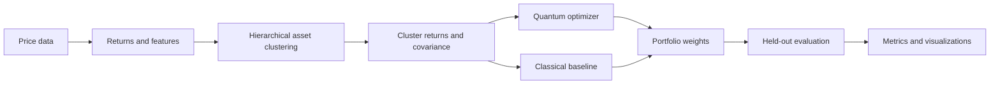
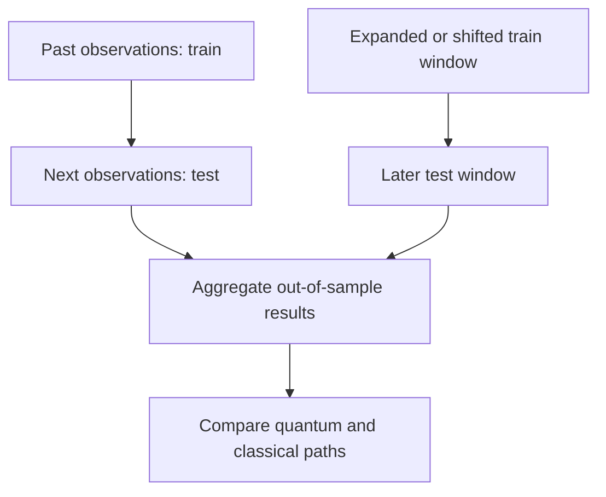

# High-Dimensional Portfolio Optimization: A Quantum Approach

### Cluster assets, compare optimizers, and evaluate portfolios across time

This Python framework studies portfolio optimization when the asset universe
is large. It groups similar assets with hierarchical clustering, builds a
lower-dimensional optimization problem, and compares a quantum approach with
a classical baseline under the same evaluation workflow.

**Research status:** The repository description does not provide benchmark
results or evidence of a quantum advantage. Treat its outputs as experimental
analysis, not investment recommendations.

[Workflow](#workflow) · [Quick start](#quick-start) ·
[Command line](#command-line) · [Configuration](#configuration) ·
[Evaluation](#evaluation-and-validation)

---

## At a glance

| Stage | Purpose |
| --- | --- |
| Financial data | Fetch prices and calculate asset returns |
| Asset clustering | Group similar assets to reduce the optimization dimension |
| Portfolio models | Run quantum and classical optimization paths |
| Training | Tune model settings with time-series splits |
| Evaluation | Compare portfolio metrics with a benchmark and visualize results |

Supported risk objectives described in the project include **variance**,
**Conditional Value at Risk (CVaR)**, and **drawdown-based** formulations.
Available constraints and solver behavior depend on the chosen configuration.

## Workflow


```mermaid
flowchart LR
    A["Price data"] --> B["Returns and features"]
    B --> C["Hierarchical asset clustering"]
    C --> D["Cluster returns and covariance"]
    D --> E["Quantum optimizer"]
    D --> F["Classical baseline"]
    E --> G["Portfolio weights"]
    F --> G
    G --> H["Held-out evaluation"]
    H --> I["Metrics and visualizations"]
```

Clustering makes the search problem smaller by summarizing related assets.
The two optimizers can then be assessed against the same return history and
benchmark. A fair comparison should hold data windows, constraints, risk
objective, and evaluation metrics constant.

## Quick start

### Install

Use Python 3.8 or newer. From a checkout of this project:

```bash
python -m pip install -e .
```

The project uses Qiskit and other dependencies declared by its package
configuration. A compatible quantum backend is selected through the YAML
configuration.

### Run an optimization

```bash
quantum-portfolio --mode optimize
```

### Use the Python API

```python
import yaml

from quantum_portfolio.data.dataset import FinancialDataset
from quantum_portfolio.models.clustering import AssetClustering
from quantum_portfolio.models.quantum_model import QuantumPortfolioModel

config_path = "config/default.yaml"
with open(config_path, "r", encoding="utf-8") as file:
    config = yaml.safe_load(file)

dataset = FinancialDataset(config_path=config_path)
clustering = AssetClustering(config)
model = QuantumPortfolioModel(config)

dataset.fetch_data()
returns = dataset.calculate_returns()
clusters = clustering.cluster_assets(returns, n_clusters=5)
cluster_returns = clustering.calculate_cluster_returns(returns)

result = model.optimize(
    cluster_returns.mean(),
    cluster_returns.cov(),
    clusters,
)

benchmark_returns = dataset.get_benchmark_returns()
metrics = model.evaluate_portfolio(returns, benchmark_returns)

print("Portfolio weights:", model.portfolio_weights)
print("Evaluation metrics:", metrics)
```

The exact data source, tickers, dates, backend, and risk settings come from
`config/default.yaml`. The example follows the API shown in the project draft;
check the installed package for any version-specific changes.

## Command line

| Task | Command |
| --- | --- |
| Optimize with defaults | `quantum-portfolio --mode optimize` |
| Tune parameters and plot | `quantum-portfolio --mode train --plot` |
| Evaluate saved parameters | `quantum-portfolio --mode evaluate --load_params params.yaml --plot` |
| Compare optimizer paths | `quantum-portfolio --mode optimize --compare --plot` |
| Use another configuration | `quantum-portfolio --config my_config.yaml` |

Run `quantum-portfolio --help` for the options supported by your installed
version.

## Configuration

The default settings live in `config/default.yaml`. Configuration covers:

| Area | Examples |
| --- | --- |
| Data | Tickers, date range, sampling frequency |
| Clustering | Method and number of clusters |
| Quantum model | Backend and ansatz |
| Optimization | Risk measure and portfolio constraints |
| Training | Cross-validation and hyperparameter search |
| Outputs | Plots and other visualizations |

Record the configuration used for each experiment so results can be compared
and reproduced.

## Evaluation and validation

Time-series validation respects the order of observations. Training windows
come before their corresponding test windows; model tuning belongs within the
training portion of each split.


```mermaid
flowchart TB
    T1["Past observations: train"] --> V1["Next observations: test"]
    T2["Expanded or shifted train window"] --> V2["Later test window"]
    V1 --> R["Aggregate out-of-sample results"]
    V2 --> R
    R --> C["Compare quantum and classical paths"]
```

```python
from quantum_portfolio.data.dataset import FinancialDataset

dataset = FinancialDataset()
dataset.fetch_data()
returns = dataset.calculate_returns()

splits = dataset.create_time_series_splits(
    data=returns,
    method="expanding_window",  # or "sliding_window"
    n_splits=5,
    test_size=60,
)

for index, (train, test) in enumerate(splits, start=1):
    print(f"Split {index}: train={train.shape}, test={test.shape}")
```

The package also describes Bayesian hyperparameter tuning through
`PortfolioTrainer`:

```python
from quantum_portfolio.training.trainer import PortfolioTrainer

trainer = PortfolioTrainer(config, dataset, clustering, model)
trainer.train()
print("Best parameters:", trainer.best_params)
final_results = trainer.final_model()
```

For any reported comparison, include the test dates, asset universe, data
cleaning rules, optimizer settings, baseline tuning, transaction-cost
assumptions, and quantum backend. This README does not include performance
numbers because none were supplied in the project draft.

## Visualizing results

The project exposes a visualization helper for portfolio weights, performance
metrics, and returns over time:

```python
import matplotlib.pyplot as plt
from quantum_portfolio.evaluation.visualization import PortfolioVisualizer

visualizer = PortfolioVisualizer(config)
visualizer.plot_portfolio_weights(final_results["portfolio_weights"])
visualizer.plot_performance_metrics(final_results["metrics"])

weights = [final_results["portfolio_weights"].get(asset, 0)
           for asset in returns.columns]
portfolio_returns = returns.dot(weights)
visualizer.plot_performance_over_time(portfolio_returns, benchmark_returns)
plt.show()
```

## Project modules

| Module | Responsibility |
| --- | --- |
| `quantum_portfolio.data` | Data acquisition and return preparation |
| `quantum_portfolio.models.clustering` | Asset grouping and cluster statistics |
| `quantum_portfolio.models.quantum_model` | Quantum portfolio optimization |
| Classical model | Baseline optimization for comparison |
| `quantum_portfolio.training` | Parameter search and validation |
| `quantum_portfolio.evaluation` | Metrics and plots |

## Research questions

- How much does clustering reduce problem size, and what information is lost?
- Does the quantum approach improve an out-of-sample objective under the same
  constraints and computational budget as the classical baseline?
- How sensitive are results to the backend, ansatz, risk measure, and market
  period?
- Do any gains remain after realistic execution assumptions are included?

The answers require measured, reproducible experiments; the presence of a
quantum optimizer alone does not answer them.
